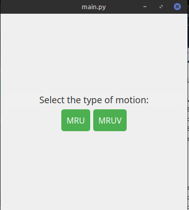
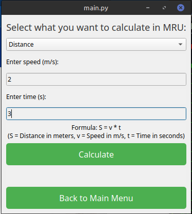
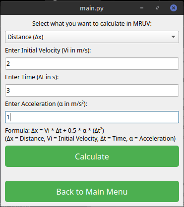
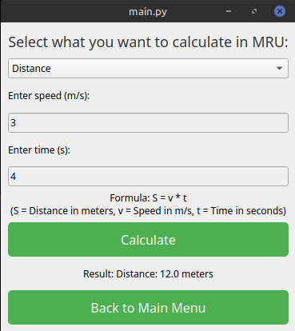
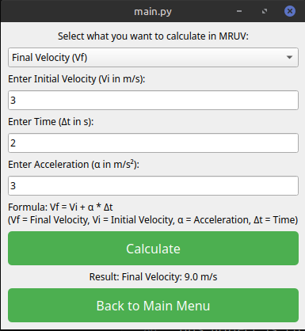

# Calculator for MRU and MRUV

This project contains a Python program designed to calculate distances, velocities, and times in the contexts of Uniform Rectilinear Motion (MRU) and Uniform Rectilinear Motion with Variable Acceleration (MRUV). The program enables users to perform interactive calculations through a menu interface.

## Project Structure

The project has the following directory structure:

```
├── README.MD
├── requirements.txt
├── result
│   ├── resultado1.png
│   ├── resultado2.png
│   └── resultado3.png
├── run.sh                        
└── source                         # Source code
    ├── main.py                    # Main file
    ├── mru.py                     # Module for MRU
    ├── mruv.py                    # Module for MRUV
    └── utils.py                   # Utility functions

```

## Installation

1. Clone the repository to your local machine.
2. Navigate to the project directory.
3. To run the program, first provide execution permissions for the `run.sh` script with the following command:

   ```bash
   chmod +x run.sh
   ```

4. After setting permissions, execute the script directly:

   ```bash
   ./run.sh
   ```

The script will automatically activate the virtual environment and launch the program, presenting a menu for users to choose between MRU and MRUV calculations.

## User Interface

The main menu allows users to select the type of motion they wish to calculate. Below are screenshots of the interface:

### Main Menu



### MRU Calculation Interface

The following image illustrates the MRU calculation interface where users input values to compute distance:



### MRUV Calculation Interface

The next image shows the MRUV calculation interface for determining final velocity based on user inputs:



## Results

The program generates reliable results based on user inputs. Here are examples of the results produced:

### Calculation of Distance in MRU

This screenshot demonstrates the result of executing the code to calculate distance using the formula \( \Delta x = v \times \Delta t \).



### Calculation of Final Velocity in MRUV

This screenshot illustrates the result of executing the code to calculate final velocity in a MRUV scenario using the formula \(Vf = Vi + \alpha \Delta t \).



## Conclusion

The developed program allows for precise calculations in the context of MRU and MRUV, providing an interactive interface that validates user inputs and delivers trustworthy results. This code serves as a useful tool for students and professionals needing to perform these calculations in practical situations.

## License

This project is licensed under the [MIT License](LICENSE).
